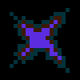
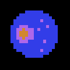
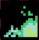
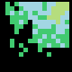
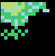

+++
title = "XX. More Background Scrolling"
weight = 900
draft = true
+++

We have covered drawing and moving sprites, but so far
we have only _drawn_ backgrounds. The NES has the ability
to scroll backgrounds by as little as one pixel per frame
in a smooth motion. In contrast, the Atari 2600's background
scrolling was much less fluid, as seen in _Vanguard_:
_Vanguard_ (SNK, 1982) was a side-scrolling shooter game originally
released in arcades and later ported to the Atari 2600.


{{ youtube(id="ewQDKtc1i-4", start=0) }}

The NES' scrolling abilities come courtesy of a few special
registers in the PPU and the way that backgrounds are laid
out in memory. As a reminder, the NES PPU's memory map has
space for four nametables, but only enough physical RAM
to hold two. Those two nametables can have either a _vertical
layout_, in which `$2000` and `$2800` are "real", or a
_horizontal layout_, in which `$2000` and `$2400` are "real".
Which layout is used depends on how the cartridge is
manufactured. Older cartridges feature "V" and "H" solder
pads on the cartridge board; whichever one has solder on it
is the layout that will be used.


The "V"/"H" solder pads on the cartridge board for _Donkey
Kong_ (Nintendo, 1983). Here, the "V" pad is soldered, meaning that
this cartridge uses a vertical nametable layout (also known
as horizontal mirroring).


## Using `PPUSCROLL`

In most cases, scrolling is controlled via writes to the
`PPUSCROLL` (`$2005`) memory-mapped I/O address
What are the "other" cases, where scrolling is handled differently?
It is possible to create "split-screen" effects, where the
top of the screen is at a different scroll position than the
bottom, by carefully manipulating the internal working of
the PPU. This requires writes to `PPUSCROLL` and `PPUCTRL`
within a very short period of time, when the PPU has almost
finished drawing the scanline before the split.
 during Vblank (i.e., in your NMI handler).
Your NMI handler should write to `PPUSCROLL` twice per frame.
The first write will determine the X scroll position, in pixels,
and the second write will determine the Y scroll position, also
in pixels. Writes to `PPUSCROLL` should always occur at the
_end_ of the NMI handler (or at least after any writes to
other PPU registers like `PPUADDR`), because the PPU uses
the same internal registers for both memory access and
scroll information, meaning writes to other PPU registers
can change the scroll position.

What the X and Y "scroll positions" mean varies based on
the cartridge's nametable layout and what has been written
to `PPUCTRL`. The PPU keeps track of a "current" or "base"
nametable, which can be set via writes to `PPUCTRL`. The
lowest two bits of a byte written to `PPUCTRL` set the
base nametable, with `00` representing the nametable at
`$2000`, `01` representing `$2400`, `10` representing
`$2800`, and `11` representing `$2c00`. Once the base
nametable has been set, the X and Y scroll positions
are offsets from that base nametable.

Consider a standard horizontal-layout game. In this
layout, there are two nametables: `$2000` and `$2400`.
If we set the base nametable to `$2000`, and set both scroll
positions to zero, the resulting background image displayed
on screen will be the entirety of the nametable at `$2000`.
Here is what that looks like:

```ca65
  ; at end of NMI handler
  LDA #$00
  STA PPUSCROLL ; set X scroll
  STA PPUSCROLL ; set Y scroll
  STA PPUCTRL ; set base nametable last
```

Now let's say we want to move the "camera" twenty pixels to
the right. With a horizontal layout, we would see all but the
leftmost twenty pixels of the nametable at `$2000` lined up with
the left edge of the screen, and the right side of the screen
would be the leftmost twenty pixels of the nametable at `$2400`.


Side-by-side nametables in a horizontal layout, with
the attribute grid visible in blue. As the player
moves to the right, the X scroll position increases
and the viewport "slides" across the two nametables.
These are the first two screens of the Metal Man stage in
_Mega Man 2_ (Capcom, 1988).


In code, that looks like this:

```ca65
  ; at end of NMI handler
  LDA #$14 ; decimal 20
  STA PPUSCROLL ; set X scroll
  LDA #$00
  STA PPUSCROLL ; set Y scroll
  STA PPUCTRL ; set base nametable last
```

What about games that use a vertical layout (or vertical
scrolling in a horizontal-layout game)? When a scroll
position is set so that the viewport would move beyond the
bounds of the two "real" nametables, the viewport wraps
around instead. However, most games do not use this
functionality; generally, a game that uses a vertical
layout will prevent horizontal scrolling and vice versa.

## Camera Systems

Now that we have seen _how_ to scroll the background, it's
time to take a look at _when_ to scroll the background. While
it might feel natural for a character moving to the right
to have the background scroll to the right with them, the
NES leaves scrolling decisions entirely up to the programmer.
Different games take very different approaches to the
question of what should trigger a scroll. These approaches
represent different _camera systems_, each with their own
advantages and drawbacks.
The examples that follow are based on Itay Keren's
seminal work on camera systems, ["Scroll Back: The Theory
and Practice of Cameras in Side-Scrollers"](https://www.gamasutra.com/blogs/ItayKeren/20150511/243083/Scroll_Back_The_Theory_and_Practice_of_Cameras_in_SideScrollers.php), which goes into far greater
detail than I will here. The terms used below (like "position-locking")
are from the same article.
 Let's look at a few basic techniques that were
common on the NES.

### Position Locking

The simplest camera system, _position locking_ keeps
the viewport locked relative to the player's position.


Position-locked camera in _Micro Machines_ (CodeMasters, 1991).
Here, the player vehicle is kept in the center of the screen
at all times.


Position locking is useful when the player needs a consistent
view distance around their character on screen. In _Micro Machines_,
which mixes high speed racing with sudden turns, the center-locked
camera gives the player a clear view of their surroundings at all times.
Similarly, in side-scrolling games, position locking on the X
axis ensures that the player can see a fixed distance to the left
and right, so they will not be surprised by enemies coming from either
side.


A horizontally position-locked camera in _Ducktales_
(Capcom, 1989). Scrooge remains in the same X position
at all times, but he can move vertically without the camera
following him.


### Camera Windows

Position-locked cameras are extremely popular on the NES, but sometimes
developers want to give the player more freedom to move around
without constantly shifting the viewport. A _camera window_
specifies a region of the screen in which the player can move
without causing the screen to scroll; attempting to move outside
of the window causes the screen to scroll instead.


A camera window in _Crystalis_ (SNK, 1990). The camera window
here is especially noticeable when the player character is moving
left or right.


### Auto-scroll

Finally, the third camera system we will look at here is
auto-scrolling. In an auto-scroll camera system, the player does
not have any control over camera movement - the camera is
constantly moving on its own, with the player either remaining
in the same position while the background scrolls below
or with the player sprites moving, by default, to match the
movement of the background.


Auto-scroll in _Star Soldier_ (Hudson Soft / Taxan, 1988).
The player's ship is totally disconnected from the background
starfield. If the player does not press any buttons, it remains
in the same place on screen as where it was before.



Auto-scroll in an airship level of _Super Mario Bros. 3_
(Nintendo, 1990). Here, when the player is not pressing buttons
on the controller, Mario moves along with the background.
When the player reaches the left edge of the screen, they remain
there but the background continues moving under them. Other
games with auto-scrolling may count hitting the left edge of
the screen as an instant death.


For our current project, we'll use a vertical auto-scroll
camera. A horizontal mirroring arrangement would be best here,
since it provides us with two nametables stacked vertically -
meaning we can update the nametable that is not currently visible
to get ready for what will need to be displayed as we scroll.


Updates during scrolling in _1943: The Battle of Midway_
(Capcom, 1988). Shown here are the four nametables during
a typical play-through of part of the first stage. The white
square represents the viewport (the area of background that is
visible to the player). _1943_ uses horizontal mirroring,
so the left and right sides shown here are identical. Notice
how the area just ahead of the white box updates during scrolling,
two rows of tiles at a time.


## Storing Background Data

We've explored how to create a camera that scrolls over multiple
screens of background, but we haven't looked into how to store
all of the data required for multiple screens of background. As
with anything else in NES development, there are many ways to
approach the problem.

### Object (Metatile) Systems

The first approach, and the simplest, is to store backgrounds as
a list of "metatiles" or "objects", along with their locations. This
is the approach used in _Super Mario Bros._ and many other
games. To use this system, first put together a list of every
"object" that your game will need to draw, and give each
a numeric ID. 
An "object", in this sense, is a complete "thing" drawn in your
game, rather than specific tiles. Example objects in _Super Mario
Bros._ include pipes, rows of blocks (of different types and lengths),
enemies, and pits in the ground.
 Then, come up with a system for indicating
locations. _Super Mario Bros._ divides the screen into a 16x16 array,
and then uses one byte for each object's location,
with the high nibble indicating the object's X-position and the low
nibble giving the object's Y-position in the 16x16 grid. In this
way, every object in a stage takes up two bytes: one for the
object ID / information, and one for the object location.
These two-byte object references are stored for each level in
order, starting with the object with the furthest left X-position
and ending with the object with the furthest right X-position.
To scroll the screen, the game code keeps a pointer into the
level's list of objects and, before each scroll, checks if a new
object would come into view. If so, it alters the nametable(s)
as needed before scrolling.
_Super Mario Bros._ can only scroll in one direction, from left
to right. This is due to the way the objects for each level are
stored. One "flag" that can be added onto an object ID indicates
a "new screen", meaning that this object appears on the next
nametable (and that nothing further will be drawn to the "old"
nametable). _Super Mario Bros._ doesn't have an equivalent
"old screen" flag or any other way to process leftward scrolling.


Object systems can result in some very compact code. The first
level of _Super Mario Bros._, which is 14 nametables in length,
is stored in ROM in only 101 bytes (including a two-byte header
and a one-byte footer that mark the beginning and end of the
level data). The downside of an object system is that anything
which is _not_ an object needs to be stored in a different way.
_Super mario Bros._ uses a technique that has been dubbed "set
decoration" for this purpose, a repeating series of three
nametables that objects from the object system are drawn
on top of.


The three nametables that make up the "set decoration" for most
levels in _Super Mario Bros._. Image from _I Am Error_ by Nathan
Altice.


### Meta-metatiles

For games that have more detailed or intricate backgrounds, a
plain object system may not be good enough. Some games, like
the _Mega Man_ series, create highly detailed backgrounds
using "meta-metatiles" - a collection of four 16x16px metatiles
to make a larger, reusable 32x32px metatile. With meta-metatiles,
a screen that previously would have been 32 tiles, or 16 metatiles,
wide is now only 8 meta-metatiles wide, significantly reducing
the amount of data needed to describe an entire nametable.
Some games take this even further. _Blaster Master_'s levels are
created from 64x64px meta-meta-metatiles, making each screen a 4x4
grid of these mammoth entities.


Usage of meta-metatiles in the backgrounds of the Metal Man
stage from _Mega Man 2_. The dashed blue lines represent the
attribute grid; each grid square is a 16x16px metatile, and
each 2x2 grid of metatiles is a meta-metatile. There is
clear repetition in meta-metatiles used to build the backgrounds,
but the overall effect does not feel repetitive. This entire
screen of backgrounds is built from only three meta-metatiles,
as seen in the second image.


### Storing Compressed Graphics

When even meta-metatiles are not enough, games can turn to storing
background data in a compressed format and decompressing it as needed.
This can be challenging given the operations available to the 6502,
but there are workable approaches common to commercially-produced
games.

Most NES compression formats use some variation of _run-length encoding_,
or "RLE". An RLE scheme stores data in a smaller format by storing repeated
instances of the same byte as a count of bytes instead. As an example,
let's look at the "Konami RLE" format, used in several Konami games including
the U.S. version of _Contra_. If a byte of Konami RLE data has a value of `$80`
or more, subtract `$80` and repeat the next byte that many times. So, for example,
a Konami RLE data section that starts with `$87 $a4` would mean "repeat byte `$a4`
seven times". If the value of the first byte is less than `$80`, there is no
repetition and the byte is read as-is. Let's look at a slightly longer example
(all values in hex):

```
3c 94 b6 85 0a 55
```

This string of bytes is interpreted as follows:

- Literal byte `$3c`
- Repeat byte `$b6` 20 times (`$94 - $80` is `$14`, or 20 in decimal)
- Repeat byte `$0a` five times
- Literal byte `$55`

This is 27 bytes of data, stored in only six bytes of memory, a massive
improvement. There are multiple approaches to RLE, as well. Some versions
devote more or less storage space to "literal" data, or use "repetition"
bytes in different ways. Here, for example, is the RLE scheme used by
the Japanese (FDS) version of _Castlevania II: Simon's Quest_:

- Byte value (_N_) less than `$80`: repeat the next byte _N_ times
- Byte value (_N_) greater than `$80`: Use the next _N_ bytes as-is
- Byte value equals `$80`: Use the next 256 bytes as-is
- Byte value equals `$ff`: End of data

When a compression scheme is used to store level data, scrolling the
screen is not a simple matter of looking for the next object to load,
because it is impossible to use compressed data with random access
(e.g., you can't answer the question "what needs to be drawn halfway across the
stage?" without starting at the beginning and working your way through
to that point). Given how the PPU works, it's common to write the compressed
data as a series of vertical stripes for horizontally-scrolling games,
or horizontal stripes for vertically-scrolling games.

## Implementing scrolling in our own game

Now that we've explored the intricacies of scrolling and level storage,
let's implement background scrolling in our own game. Our goal is to
create an auto-scrolling playfield that is four nametables in length.
Our backgrounds are mostly empty, so we will use an object system
for storing our levels since it is the easiest to implement.

Our first step will be to come up with a list of objects and create
matching graphics. We'll need:

- Galaxies
- Satellites
- A space station
- Stars
- Planets

Each of these objects will be 2x2 tiles (or made up of 2x2 tile blocks)
and, for simplicity, aligned to the attribute table grid. I've created some
graphics for each of these categories and put them into a new .chr file
(`scrolling.chr`).


The new background tiles in `scrolling.chr`.


Let's also create our own "set decoration" of stars to be drawn by default
on every screen. The existing nametable from the previous chapter should
work well enough for now. To make it work with our object system, though,
we'll need to convert the code into a series of objects. We could either
put these into their own separate data set, which would make it so we have
to check two different sets of data, or we could combine them with the
"actual" objects, which would require us to repeat them for every nametable.
The second approach gives us a bit more flexibility, so we'll go with that
for now. Once we put everything together, our update routine will look like this:

- Subtract one from "current line" counter, or reset it to 239 if it was zero
(since there are 240 horizontal lines per screen / nametable)
- Check if the current line puts us within eight lines of a new object; if so, run code
to draw it
- Scroll the screen by one pixel

Finally, we'll need to come up with a data format for storing our "levels", the
series of objects and where they appear. For simplicity, let's use a modified
version of the _Super Mario Bros._ object system. Each object will be represented
by two bytes. The first byte will indicate the rough X and Y location of the object,
and the second byte will indicate which object to draw. To convert from object bytes
to actual drawing code, we'll use a _look-up table_, or "LUT". The LUT will be a map
from data bytes (object numbers) to the memory address of a subroutine that carries
out that object number's drawing code. We'll need to store a full 16-bit memory
address for each subroutine, because we don't know how much code will be required for
each subroutine. As a result, our LUT will be set up like this:

```
$00-$01    object 1 subroutine address
$02-$03    object 2 subroutine address
$04-$05    object 3 subroutine address
...
```

Since each subroutine address takes up two bytes, we can store 128 object
subroutines in our table. Actually using the LUT looks something like this:

```ca65
callObjectSubroutine:
  JMP (pointer)
  ; notice - no RTS here, because we used JMP

  ; object number stored in accumulator to start
  ASL             ; multiply by 2, so "2" becomes $04, etc.
  TAX             ; copy it to the X register
  LDA lut, X      ; indexed addressing into the LUT
  STA pointer     ; store to a zeropage variable
  LDA lut+1, X    ; get the next byte after "lut, X"
  STA pointer+1   ; store it in the zeropage address right after pointer
  JSR callObjectSubroutine  ; call a subroutine that does our object code

; in our subroutine code:
; do actual drawing-the-object work, then...
  RTS  ; return to where we were when we did callObjectSubroutine
```

This is a bit convoluted, so let's walk through it step by step. First,
we need to figure out which object subroutine we want to call (i.e.,
which object we are going to draw). We put that value into the accumulator,
and run the code that starts at `ASL`. This looks up two values from the LUT,
which is the two bytes that make up the address of our object-drawing
code. The 6502 is a "little-endian" architecture, meaning it expects to
see the low byte of an address first. We'll need to store our handler addresses
as their low byte followed by their high byte. We put those two address bytes
into two bytes of zeropage memory. We could 


### The object drawing system

With the implementation approach settled, let's talk in more detail about how our
code will work. Each "object" in our level data will be a 2x2 square of tiles.
The first byte of each two-byte pair will store the object's X and Y positions
on screen, using 4 bits for X and 4 bits for Y. That gives us 16 possible values
for each of X and Y. We'll take the X and Y amounts and multiply them by two
(using `ASL`) to find the nametable coordinates for the tiles.

Assuming that our location byte's format is `XXXXYYYY`, how do we find those
coordinates using assembly? To find the X coordinate, we need to chop off the
Y values using a logical filter, and then shift the X values to the right
the appropriate number of times. Here's code to do that:

```ca65
  LDA location_byte
  AND #%11110000
  LSR
  LSR
  LSR
```

In this code, we start by putting the location byte into the accumulator. Next,
we use `AND` to remove the Y values from the byte. Remember that the operand for
`AND` determines what will happen with each bit; if a bit position in `AND`'s
operand is a `1`, that bit position will remain unchanged in the output, and
if a bit position in `AND`'s operand is a `0`, that bit will be a guaranteed
`0` in the output. With the Y values removed, we use `LSR` three times to
get the X value, multiplied by two and ready to use as a nametable location.
To find the Y value, we can use an `AND` operand of `#%00001111`, followed
by a single `ASL` to multiply by two.

Now let's look at the objects themselves. Here's a listing of all objects,
with an associated index. First, the three "small stars" that make up the
set decoration:

- `$00`: Small star 1
- `$01`: Small star 2
- `$02`: Small star 3

Next, the new background graphics, with an image for each:


| Index | Object                | Image                     |
| ----- | --------------------- | ------------------------- |
| `$03` | Large star            |  |
| `$04` | Planet                |     |
| `$05` | Galaxy (top left)     |   |
| `$06` | Galaxy (top right)    |   |
| `$07` | Galaxy (bottom left)  |   |
| `$08` | Galaxy (bottom right) |   |

