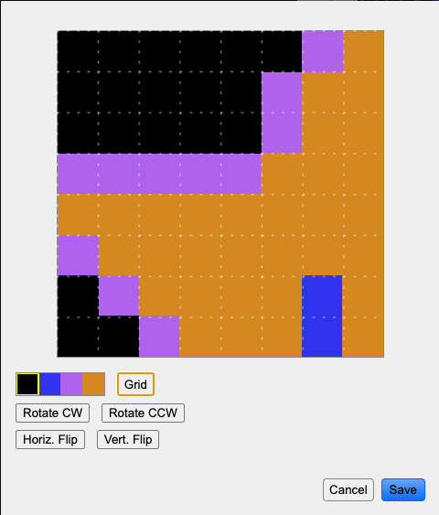

+++
title = "NES Lightbox"
template = "page.html"
+++

A simple application to help with creating NES graphics

<figure>
  
</figure>

## Latest release: 1.0.0

- Windows (x64, portable): [NES Lightbox Setup 1.0.0.exe](releases/1.0.0/NES%20Lightbox%20Setup%201.0.0.exe)
- Mac (dmg): [NES Lightbox-1.0.0.dmg](releases/1.0.0/NES%20Lightbox-1.0.0.dmg)
- Linux (AppImage): [NES Lightbox-1.0.0.AppImage](releases/1.0.0/NES%20Lightbox-1.0.0.AppImage)
- Linux Snap (for Ubuntu): [neslightbox_1.0.0_amd64.snap](releases/1.0.0/neslightbox_1.0.0_amd64.snap)

Source code available [on GitHub](https://github.com/kzurawel/neslightbox).

## What is this?

NES Lightbox provides tools for working with NES/Famicom tilesets (.CHR files), color palettes,
and nametables (backgrounds). These tools allow you to:

- Create new tiles to save as a CHR file
- Load, edit, and save existing CHR files
- Find tile index numbers by hovering over them
- Visually create sprite/background palette sets
- Find NES color index numbers for use in your code
- Visually place tiles into a background nametable, with correctly-applied palettes and attribute values
- Collect nametable and attribute table offset information for any location in the nametable
- Save and reload nametable and palette values to allow for quick edits

## How do I use it?

Let's assume that you want to create a new tileset from scratch. When you open
NES Lightbox, the tileset display in the top right is empty. Click the "Grid"
button to better see the boundaries of each individual 8x8px tile. The "Bank A"/
"Bank B" toggle lets you flip between sprite and background tiles. Hovering
over a tile space will show the associated tile index number in the status
bar at the bottom of the app. To edit a tile, click on a tile in the tileset
display to highlight it (yellow border), then click the "Edit" button. This
will bring up the tile editor view:

<figure>
  
</figure>

The palette swatches come from whatever palette was selected in the main window
when you clicked "Edit" (by default, the first palette). To change the pixels
that make up the tile, click a palette color to select it and then click a pixel
in the tile to set it to that palette color. (Remember, tiles on the NES only
store <i>which color index in a palette</i> to use, not a specific color.) You
can also use the rotate and flip buttons to easily make larger edits to a tile.
When you are done editing a tile, click "Save," or click "Cancel" to discard
your changes.

Now that you have some tiles created, you can save a .chr file with Tilesets
&rarr; Save CHR As..., and then use it in your NES code. You can also use
your tiles to create backgrounds for use in your project. First, set up
the palettes you would like to use to draw the background. The NES provides
you with four four-color palettes, with the first color of each palette
being the same for all palettes. To change palette colors, click a palette
color to highlight it and then click a color from the large palette display.
Hovering over colors in either the large palette or the individual 4-color
palettes will display the byte that corresponds to that color in the status
bar at the bottom of the app. Clicking any palette color in a four-color
palette will also select that palette as the currently active palette,
which will update the colors the tiles in the tileset display are drawn with.

To draw a nametable, select a palette and a tile, then click anywhere in the
left-side nametable display to place that tile with the selected palette. Clicking
"Attribute grid" will turn on a grid of red dashed lines that shows the
boundaries of each attribute table byte. Clicking "Tile grid" will turn on
a more fine-grained grid that shows the position of each inidividual tile
in the nametable. Hovering over any tile in the nametable display will
show in the status bar the "nametable offset" for that tile and the four corresponding
nametable addresses, as well as the offset of the attribute table byte
that affects that tile and the four corresponding attribute table addresses.

Once you've found palettes you like or started on a nametable you want to
save for future editing, save those files via Palettes &rarr; Save Palettes As...
and Nametables &rarr; Save Nametable As.... Alternatively, you can save a "project",
which is a combination of tileset, palettes, and nametable. To do so, choose
Project &rarr; Save Project As..., then choose a name for your project. Any
tilesets, nametables, or palettes that you have opened will be saved with
their existing filename, and whatever you have not yet saved will have the
name of the project with the appropriate file extension (.chr, .nam, .pal).
The project itself will be a .nesproj file, which is just a JSON file with
paths to each file in the project. If you later re-open a project with Project
&rarr; Open Project..., it will automatically load all of the files in the project.

That's the overview. I hope you enjoy using NES Lightbox as much as I have enjoyed
building it!

## Credits

<ul>
  <li>NES Lightbox is copyright &copy; 2021 Kevin Zurawel, licensed under a
    Creative Commons Attribution-NonCommercial-ShareAlike 4.0 International License.</li>
  <li>Some code within NES Lightbox is heavily based on code from Jeremy Whiting's
    <a href="https://github.com/jpwhiting/nestool">NESTool</a> project.</li>
  <li>Overall app design and functionality based on Shiru's
    <a href="https://shiru.untergrund.net/software.shtml">NES Screen Tool</a>.</li>
  <li>App icon by Ahuri (buzzstarlight@gmail.com), released under an unspecified
    Creative Commons license.</li>
</ul>

## Roadmap

These are features that I would like to add to NES Lightbox in a future version:

<ul>
  <li>Display tile value / attr byte value in status bar when hovering over a nametable space</li>
  <li>Load/save CHR from a ROM (.nes) file</li>
  <li>Support for exporting/importing RLE-compressed nametables</li>
  <li>Multi-nametable support</li>
  <li>Image import (auto-convert to tileset and nametable)</li>
  <li>Finding and removing duplicate tiles</li>
  <li>Ability to save less-than-8KB tilesets, for use with mappers</li>
</ul>
